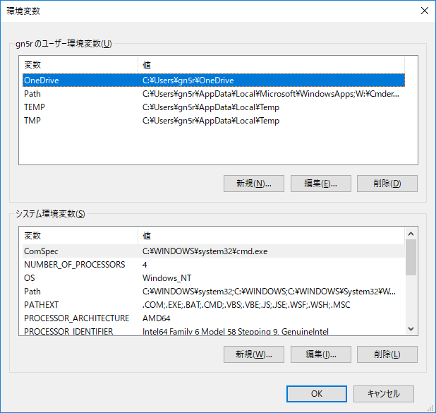
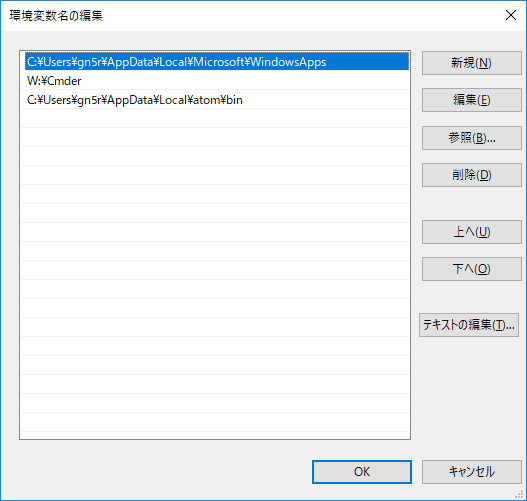
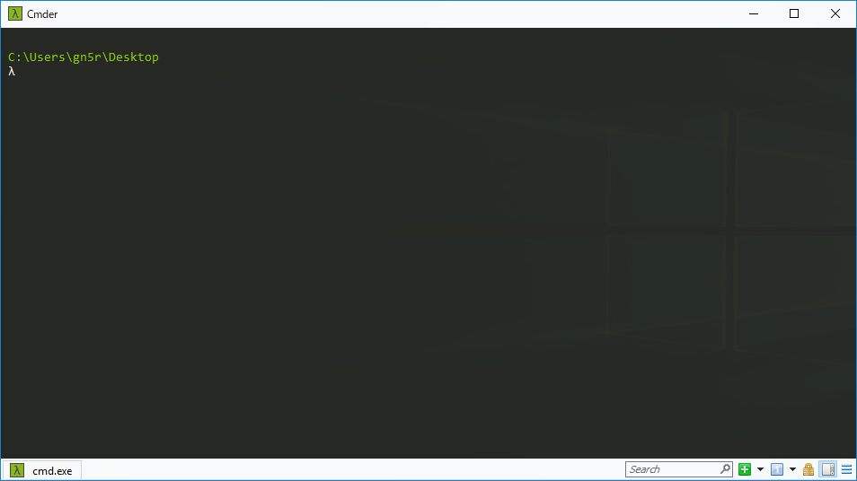
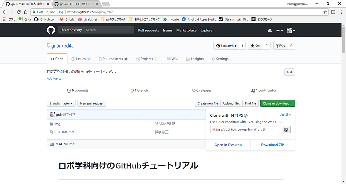
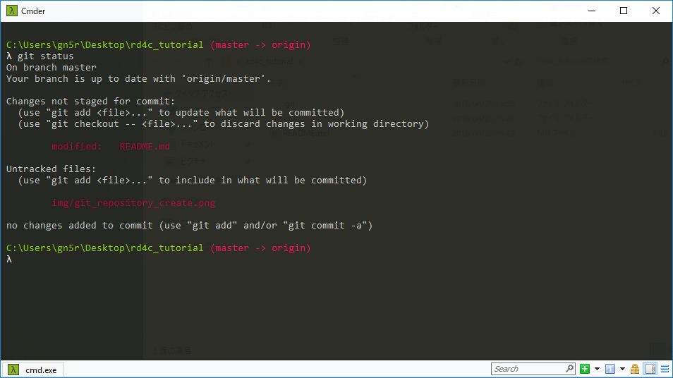

# ロボ学科向けのGitHubチュートリアル

----
更新状況
- 2018年4年25日(水) 初版アップロード
- 2018年4月26日(木) もくじ作成
----

## もくじ
- [GitHubアカウントの取得](#GitHubアカウントの取得)
- [はじめに](#はじめに)
- [Cmderの設定](#Cmderの設定)
- [Cmderの初期設定](#Cmderの初期設定)
- [GitHubサイトでリポジトリを作成する](#リポジトリを作成する)
- [Gitの基本操作](#Gitの基本操作)
- [変更～アップロード編](#変更～アップロード編)
----


## GitHubアカウントの取得
[GitHub公式サイト](https://github.com/)にアクセスし、**sign up** をクリックし新規アカウントを作成してください。<br>

|       名称      |           入力事項        |
| :------------: | :-----------------------: |
| UserName       |    日本でいうID的なもの     |
| Email Address  | 常時受信可能なメールアドレス |
| Password       | お好きなパスワードをどうぞ   |

**Create an Account** をクリックし画面下の**Finish sign up**をクリックでアカウント作成が完了します。<br>
なお、入力したメールアドレスに確認メールが来ていると思いますのでチェックしてください。<br>
なお、途中の画面の内容を忘れてしまっているので適宜画面を見ながら説明するかもしれません。

## はじめに
WindowsにてGitを扱うには**ターミナルソフト**が別途必要です。<br>
[ここ](http://cmder.net/)にアクセスし、**Full Version** をダウンロードしておいてください。(zipファイルになっています)<br>
解凍先はC直下やユーザーフォルダ直下など、分かりやすい場所にしてください。(後ほどのパス通しで面倒ごとを防ぐため)<br>
解凍が終わったら、**コントロールパネル→システム→システムの詳細設定→環境変数** を順に遷移。<br>



上図のような画面が出ると思うので、**Path** を選択し編集をクリック。



このような画面が出るので**新規**をクリックし、`C:\Cmder`など**Cmder.exe**が格納された(先ほど解凍先にしたフォルダ)を指定する。<br>
入力が終わり次第、OKを押して適用させる。

## Cmderの設定<a name="Cmderの設定"></a>
コマンドプロンプトを**管理者権限**で起動させ、以下コマンドを入力してください(Windows10であればWinキー+Xでメニューを表示させAを押下)<br>
`cmder /REGISTER ALL`<br>
このコマンドを打つことにより、右クリックした場所をカレントディレクトリとしてCmderを開くことができるようになります。<br>
Cmderの導入から初期設定はここまでです。

## Cmderの初期設定
上記でCmderの設定などが完了したので、次にGitコマンドを使うための初期設定を行います。<br>

Cmderを何らかの形で起動させると以下画面が出ると思います。



`git config --global user.email "GitHubの登録に使用したメールアドレス"`<br>
`git config --global user.name "GitHubに登録したアカウントのUserName"`<br>
これら2つのコマンドを打ち込んでおいてください。<br>
**--global** オプションを指定した場合、全てのディレクトリで適用されるので、ディレクトリごとにアカウントを変えたい等があるならば<br>
**--global** オプションを外しても構いません。

## リポジトリを作成する
[GitHub公式サイト](https://github.com/)にアクセスし、作成したアカウントでログインして下さい。<br>
**New Repository** と緑色のボタンがあると思うのでクリックして下さい。<br>
以下、各項目の説明です。

| 名称     |  入力事項     |
| :-------------: | :-------------: |
| Owner       | 基本的には自分しか選べないはず       |
| Reository Name | URLでは github.com/ユーザー名/リポジトリ名 となります |
| Description | 説明を記入　|
| Public / Private | Privateは課金です |
| Initialize thi repository with a README | チェック入れると作成時にREADMEも作成されます |
| Add .gitignore | .gitignoreは不要ファイルを列挙し、gitに上げない様にするためのファイル |

リポジトリを作成すると以下のような画面になるかと思います。(若干違うかと思いますが、適宜読み替えてください)



`https://github.com/gn5r/rd4c.git`と書いてある部分の右にあるマークを押すとコピーできます。<br>
早速、作ったリポジトリをPCに関連付けましょう。

## Gitの基本操作
**workspaceフォルダ** をどこか分かりやすい場所に作成しておいてください(知識がある人、管理ができている人は強制しません)<br>
僕の場合は **W:\workspace** に新しくフォルダを作成します。<br>
`tutorial`、`sample`など、練習や例題を意味するフォルダなどを作るといいかもしれません。<br>
Cmderを先ほど作ったフォルダ上で起動します(エクスプローラー上で何もないところを右クリック→Cmder Here)<br>

カレントディレクトリが、`W:\workspace\tutorial\`のように表示されていればOKです。(これは一例です)<br>
Cmderはコマンド入力待ち状態なので、以下コマンドを入力

```
git init ←カレントディレクトリをGitと関連付けるための初期化
git remote add 変数名(分かりやすいもの) 先ほどGitHub上で作成したリポジトリURL
git pull 変数名 ブランチ(master)
```

addするURLは公式サイト上でコピーした状態なら、Cmder上で右クリックするとペーストできるので活用してください。<br>
また、上記にて**変数名**と書きましたが、基本は**origin**と入力するようです。が、ちょっと長いので僕は**main**と入力しています。(日本語が無効なのは勿論理解できますよね？)<br>
`git pull 変数名 ブランチ`でGitHubからダウンロードしています。**ブランチ** とはユーザー名のようなものです。GitHubのUserNameとは別に設定ができます。 <br>
後ほど説明しますが、**master** はpullする時のみに入力すると思ってください。

### 変更〜アップロード編
上記ではinitからpullまでのリモートとローカルの関連付けを終えました。<br>
次はローカルで変更した内容をリモートに反映させましょう。<br>
Cmderは閉じずに以下コマンドを入力してください。

`vim README.md`<br>
すると何やら編集画面が出てきますので、**iキー** を押して入力状態にしましょう。<br>
キーボードの矢印キーでカーソルを最後の行に移動して以下文を追記<br>
`##(半角スペース)Tutorial`<br>
入力が終わったら **Escキー(エスケープ)** を押して入力状態から抜け出します。<br>
すると編集画面のままコマンド待機状態になるので`:wq`と打ち込みEnterキー押下で保存・終了してください。

Cmderの画面に戻ったかと思います。では何をしたのかを確認しましょう。<br>
`git status`と打ち込んでください。赤い文字で何やら出てくると思います。<br>



このような画面が出てくると思います。何かファイルに対し変更があると、赤文字で知らせてくれます。<br>
ではこの変更をGitHubに反映させましょう。<br>
アップロードする前にブランチの設定をしておく必要があります。<br>
ダウンロード編でも少し説明した通り名前です。masterはリポジトリの親とでも言いましょう。<br>
グループ製作なので、みんながmasterブランチでアップロードすると、だれがどこを変えたかわからなくなってしまいます。<br>
ですので、分かりやすく短いブランチに変更します。<br>
`git checkout -b ブランチ名`<br>
ブランチ名はいろんな場所で表示されるので、みんなが分かるような名前にしましょう。またやけに長いと入力も面倒なので注意してください。<br>
では、名前も変更したのでアップロードしたいと思います。まずアップロード対象を決定させます<br>
`git add ファイル名(拡張仕込み)`または`git add .(ドット)`<br>
`git commit -m "変更・追加内容などを記入(日本語可)"`<br>
`git push 変数名 ブランチ`<br>
この3行はセットで打ち込みます。**add→commit→push** という一連動作になります。<br>
また、add時に.(ドット)を指定すると全てのファイルをアップロード対象とします。<br>
初回アップロード時はGitHubへのログイン画面が出てくると思いますので、各々のUserNameとPasswordを入力して下さい。<br>
正しくアップロードできたかはCmderのログを見るか、GitHubリポジトリページを開けば確認できます。
